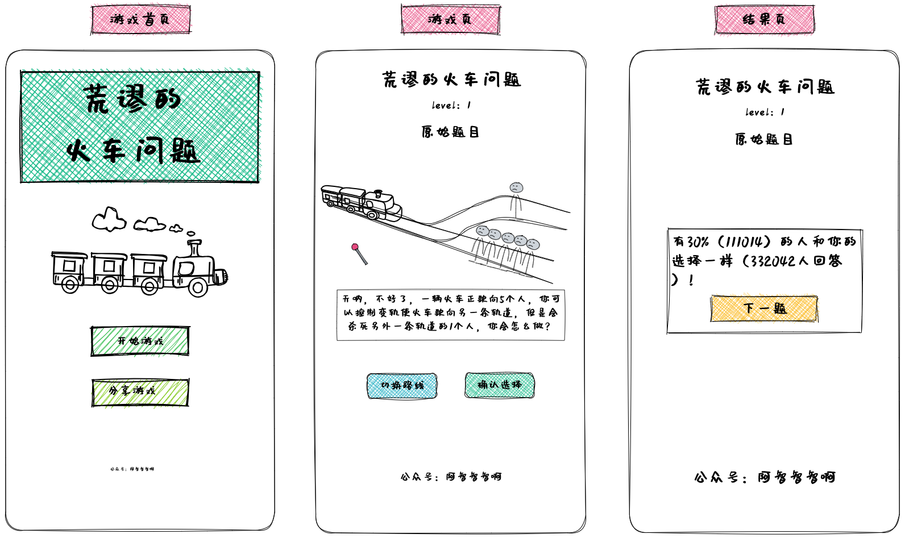

# 电车难题

> 一辆失控的列车在铁轨上行驶。在列车正行进的轨道上，有五个人被绑起来，无法动弹。列车将要碾压过他们。你站在改变列车轨道的操纵杆旁。如果拉动此杆，则列车将切换到另一条轨道上。但是，另一条轨道上也有一个人被绑着。你有两种选择：
> 	1.  什么也不做，让列车按照正常路线碾压过这五个人。
> 	2.  拉下操纵杆，改变为另一条轨道，使列车压过另一条轨道上的那个人。
> 引用自维基百科: [有轨电车难题](https://zh.wikipedia.org/zh-hans/%E6%9C%89%E8%BD%A8%E7%94%B5%E8%BD%A6%E9%9A%BE%E9%A2%98)

## 截图

## 说明

使用 cocos-creator + TypeScript 开发的 2D 小游戏。手绘风格的游戏图片资源使用 Excalidraw 绘制。

- cocos-creator == 3.6.3

由于后来一些个人原因，处于未完成状态。后续有机会的话会补全的。感兴趣的朋友也可以自己补全。

[开发文档](docs/README.md)

## 运行

使用 cocos-creator 导入项目，运行即可，可选择运行到浏览器或者模拟器。

## 其他

[Cocos Creator - 高效轻量的跨平台3D/2D图形引擎](https://www.cocos.com/creator)

[Excalidraw | Hand-drawn look & feel • Collaborative • Secure](https://excalidraw.com/)

[沐瑶随心手写体：随心是源于自由的快乐 免费商用手写字体 推荐-猫啃网](https://www.maoken.com/freefonts/1323.html)

使用Obsidian 中的 Excalidraw 插件，可以配置一个自定义字体。手写风格很赞。

## License

[MIT](https://choosealicense.com/licenses/mit/)

