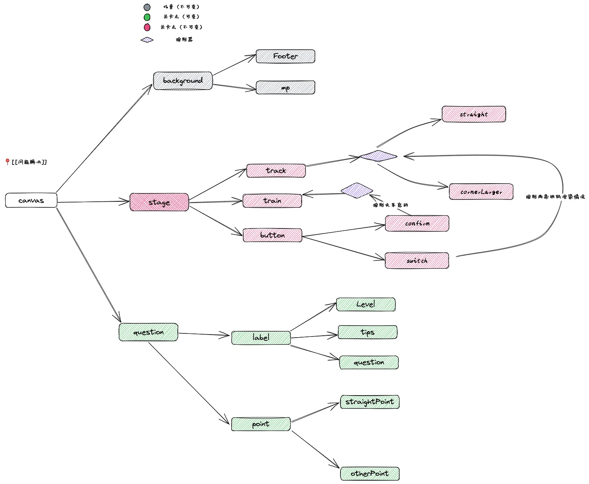

# 电车难题

> 一辆失控的列车在铁轨上行驶。在列车正行进的轨道上，有五个人被绑起来，无法动弹。列车将要碾压过他们。你站在改变列车轨道的操纵杆旁。如果拉动此杆，则列车将切换到另一条轨道上。但是，另一条轨道上也有一个人被绑着。你有两种选择：
> 	1.  什么也不做，让列车按照正常路线碾压过这五个人。
> 	2.  拉下操纵杆，改变为另一条轨道，使列车压过另一条轨道上的那个人。
> 引用自维基百科: [有轨电车难题](https://zh.wikipedia.org/zh-hans/%E6%9C%89%E8%BD%A8%E7%94%B5%E8%BD%A6%E9%9A%BE%E9%A2%98)

## 界面元素说明

需要的图片资源可以实用 Obsidian 导入 draw 文件夹中的文件，可以选择选中的某一个元素复制为 png，再进行保存。

## 任务梳理
- [x] TODO 首页三元素渲染 #game #gameRender 
	- [x] TODO 游戏标题 #game #gameRender game
	- [x] TODO 小火车图片 #game #gameRender
	- [x] TODO 按钮组 #game #gameRender
- [ ] TODO 首页元素业务逻辑 #game #gameCtrl 
	- [x] TODO 开始游戏 #gameCtrl
	- [ ] TODO 分享游戏 #gameCtrl
- [x] TODO Play页面渲染 #game #gameRender
	- [x] TODO 铁轨渲染 #gameRender
	- [x] TODO 火车渲染 #gameRender
	- [x] TODO 按钮渲染 #gameRender
		- [x] TODO Switch控制 #gameRender
		- [x] TODO 切换选择 #gameRender
		- [x] TODO 确认选择 #gameRender
	- [x] TODO 游戏点渲染 #gameRender
		- [x] TODO 直轨道被撞的元素 #gameRender
		- [x] TODO 转弯轨道被撞的元素 #gameRender
- [ ] TODO Play页面业务逻辑 #gameCtrl 
	- [x] TODO 点击切换选择按钮 切换Switch图片 以及铁轨的选中状态 #gameCtrl
	- [ ] TODO 提交选择 #gameCtrl 
- [ ] TODO 游戏结算页渲染  #gameRender 
	- [ ] TODO 提交统计  #gameRender 
	- [ ] TODO 下一关按钮  #gameRender 
- [ ] TODO 关卡元素绘图

## 关卡设置

-   level1
	- 1个人
	- 5个人
	- 天呐，不好了，一辆火车正驶向5个人，你可以控制变轨使火车驶向另一条轨道，但是会杀死另外一条轨道的1个人，你会怎么做？
-  level2
	- 4个人
	- 5个人
	- 天呐，不好了，一辆火车正驶向5个人，你可以控制变轨使火车驶向另一条轨道，但是会杀死另外一条轨道的4个人，你会怎么做？
- level3
	- 5个人
	- 你的积蓄
	- 哦，不！ 有一辆手推车正在向5个人行驶。你可以拉动杆，将其转到另一条轨道上，但那样会毁掉你的人生积蓄。你会怎么做？
- level4
	- 5个人
	- 蒙娜丽莎
	- 哦，不！ 有一辆手推车正在向5个人行驶。你可以拉动杆，将其转到另一条轨道上，但那样会毁掉蒙娜丽莎的原画。你会怎么做？
- level5
	- 1个人
	- 1个富翁
	- 哦，不！有一辆手推车正在向一个富人行驶。 富人提议支付给你$500,000以拉动杆，这将使手推车转向并杀死其他人。 你会怎么做？
- level6
	- 1只猫
	- 5只龙虾
	- 哦，不！ 有一辆手推车正在向5只龙虾行驶。你可以拉动杆，将其转到另一条轨道上，然后撞死一只猫。你会怎么做？
- level7
	- 1个清醒的人
	- 5个睡着的人
	- 哦，不！有一辆手推车正在向5个正在睡觉而不会感到痛苦的人行驶。你可以拉动杆，将其转到另一条轨道上，但那样会撞上一位清醒的人。你会怎么做？
- level8
	- 1
	- 2
	- 个人选择
	- 哦不！一辆手推车正朝着五个人的方向行驶，他们把自己绑在了轨道上。你可以拉动杆，将其转向另一条轨道，从而意外跌入轨道的一人会遇难。你会怎么做？
- level9
	- 1
	- 5
	- 怜悯
	- 哦，不！一辆手推车正向5个人驶去。杠杆只是加速了小车，这可能会让它不那么痛苦。你是做什么的？
	- 开关只会加速火车的行驶
- level10
	- 0
	- 1
	- 给你带来不便
	- 哦，不！一辆手推车正朝着一个人驶去。你可以拉动杠杆将其转移到另一个轨道，但这样你的亚马逊套餐就会迟到。你是做什么的？
- level11
	- 1
	- 5
	- 最好的朋友
	- 哦，不！一辆手推车正向你最好的朋友驶去。你可以拉动操纵杆将其转移到另一条轨道，从而杀死5名陌生人。你是做什么的？
- level12
	- 1
	- 5
	- 看不太清
	- 哦，不！一辆手推车正向5个人驶去。你可以拉动操纵杆将其转移到另一条轨道上，从而导致1人死亡。至少，这是你认为正在发生的事情。你忘了戴眼镜，看不清楚。你是做什么的？

更多
